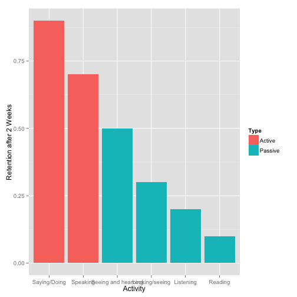
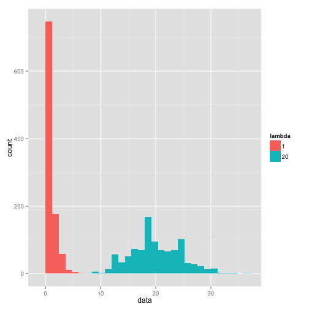

## Active Learning

1. Human being retain information far better when actively doing vs. passively hearing
2. Distributions are hard for many beginning students to understand
3. An interactive, modifiable display of a distribution can give students great statistical intuition

--- .class #id 

## Impact on Retention

Learning by doing is far better at creating retention after 2 weeks (Edgar Dale, 1946):

 

---

## Distributions are Hard -- Try Predicting The Below


```r
# Poisson of lambda 1 vs. 20
x1 <- rpois(n=1000, lambda=1); x2 <- rpois(n=1000, lambda=20); label1 <- as.factor(rep(1, times=1000)); label2 <- as.factor(rep(20, times=1000)); df1 <- data.frame(x1, label1); df2 <- data.frame(x2, label2); names(df1) <- c("data", "lambda"); names(df2) <- c("data", "lambda"); dftotal <- rbind (df1, df2)
ggplot(dftotal, aes(data, fill=lambda)) + geom_bar(binwidth = diff(range(dftotal$data))/30)
```

 

---

## Interactivity

That last slide would have been much better with interactivity.

Try the app [here](https://j-wang.shinyapps.io/shiny_app/)!

